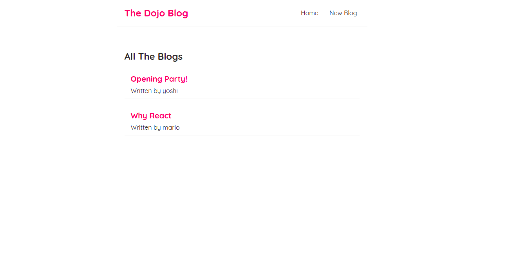
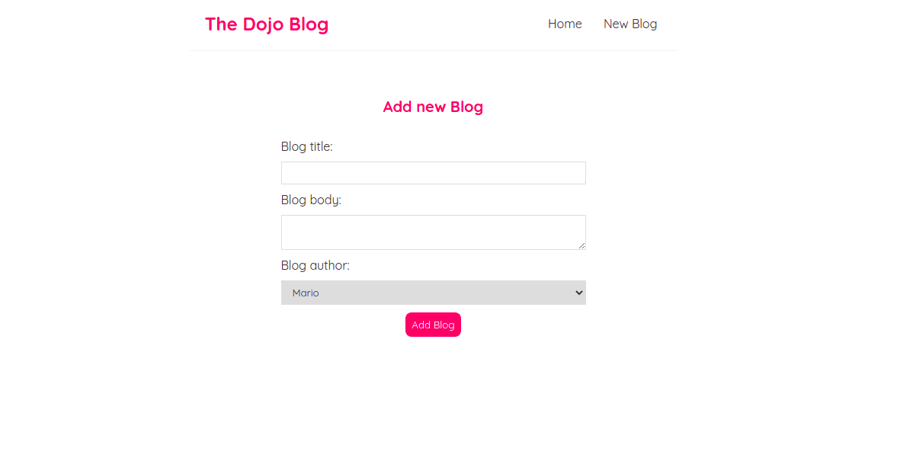
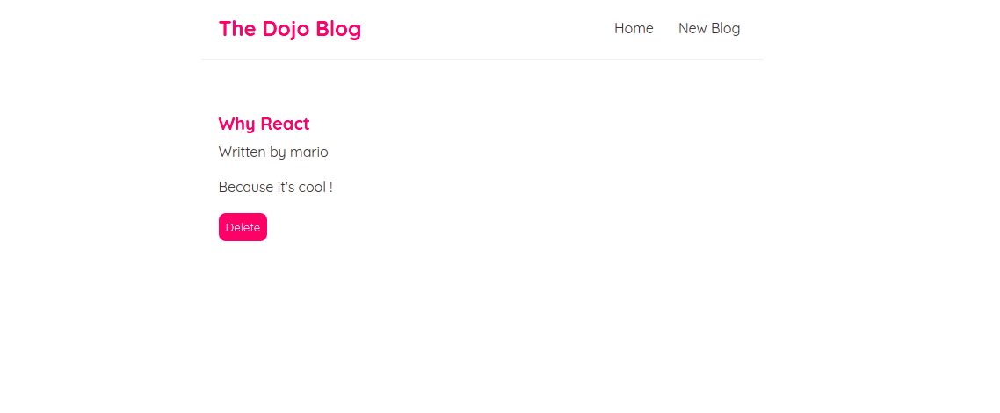

# Dojo Blog

## Description

This is a simple blog app where the user can create and delete blogs.
This app is the result of a React tutorial made by The Net Ninja.
Check his Youtube channel: [The Net Ninja](https://www.youtube.com/channel/UCW5YeuERMmlnqo4oq8vwUpg)

## Available Scripts

### Install Dependencies

```
npm install
```

### Run The App

```
npx json-server --watch data/db.json --port 8000
npm start
```

## Project Previews

### Home page



### Create New Blog page



### Blog Details page


